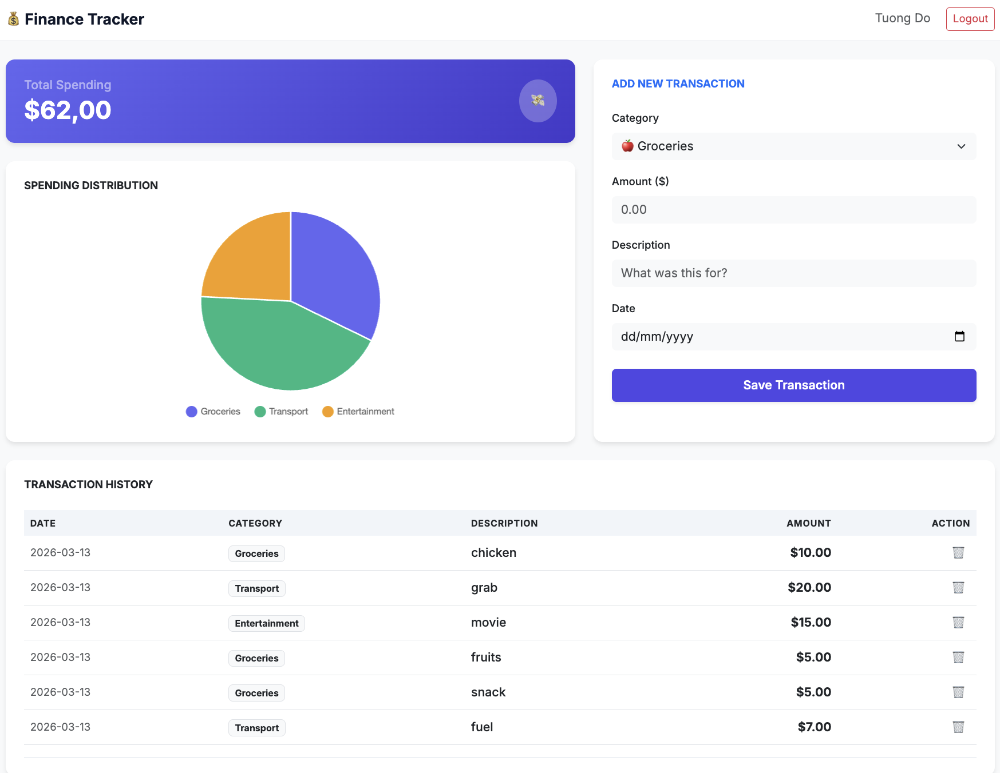

# Personal Finance Tracker

<p>
  
<p>

A full-stack web application designed for personal expense management. This project features a responsive dashboard with real-time data visualization, built with a focus on clean architecture and efficient data handling.

## 🌟 Key Features
* **Full CRUD Lifecycle**: Create, view, and delete financial transactions seamlessly.
* **Interactive Dashboard**: Dynamic spending distribution analysis using Chart.js.
* **Modern UI/UX**: Built with Bootstrap 5, featuring a sticky-header scrollable table for large datasets.
* **Robust Backend**: RESTful API built with FastAPI and Pydantic for strict data validation.
* **Relational Database**: Persistent data storage using SQLAlchemy ORM and SQLite.

## 🛠️ Tech Stack
* **Language**: Python 3.9+, JavaScript (ES6+).
* **Backend Framework**: FastAPI.
* **ORM/Database**: SQLAlchemy, SQLite.
* **Frontend**: HTML5, CSS3, Bootstrap 5, Chart.js.
* **Development Tools**: VS Code, TablePlus, Git.

## 📋 Project Structure
```text
.
├── main.py              # FastAPI application & API endpoints
├── database.py          # Database configuration & Models
├── finance.db           # SQLite database file
├── static/
│   └── index.html       # Frontend dashboard
└── requirements.txt     # Project dependencies
```
🚀 Installation & Setup
1. Clone the repository:

```Bash
git clone https://github.com/tuongdo3011/personal-finance-tracker.git
cd personal-finance-tracker
```
2. Create a virtual environment:

```Bash
python3 -m venv env
source env/bin/activate
```
3. Install dependencies:

```Bash
pip install -r requirements.txt
```
4. Run the application:

```Bash
uvicorn main:app --reload
```
The app will be available at: http://127.0.0.1:8000
